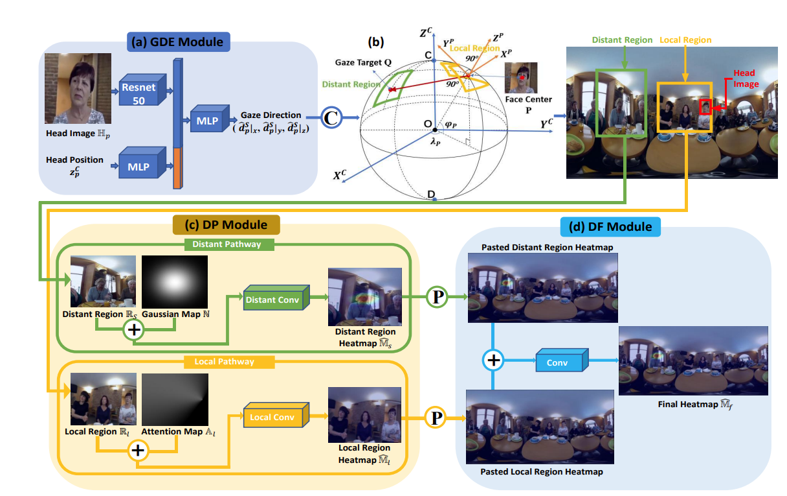

# Looking here or there? Gaze Following in 360-Degree Images

# How to use

```
# train the gde module firstly
python train.py
# train the dp module after loading pretrained gde model
python train_dp.py 
# train the df module after loading pretrained gde and dp model
python train_all.py
```

# Model

paper ：Looking here or there? Gaze Following in 360-Degree Images

[paper link](https://openaccess.thecvf.com/content/ICCV2021/papers/Li_Looking_Here_or_There_Gaze_Following_in_360-Degree_Images_ICCV_2021_paper.pdf)

github link：[Rao2000/gazefollow360: The paper &#34;Looking here or there? Gaze Following in 360-Degree Images&#34; implementing with Pytorch (github.com)](https://github.com/Rao2000/gazefollow360)

In this paper, a new task of gaze following in 360-degree images was studied, and a new large-scale dataset named "GazeFollow360" was collected for this task. The paper pointed out that the main challenge of this new task is the distortion caused by the projection of the spherical image onto a flat plane and the mismatch between the gaze target and the gaze direction of human subjects. To address this problem, a dual-path framework was proposed, which models gaze guidance in 3D spherical space instead of simply detecting gaze targets in parallel in local and distant regions on the 2D image plane. The strong performance of the proposed framework on GazeFollow360 validates its potential in understanding gaze behavior in the real 3D world.

The main contributions can be divided into three parts:

* The first work on gaze following in 360-degree unwrapped images.
* Establishing a dataset of 10,058 images.
* Proposing a dual-path framework to solve gaze following in 360-degree scenes.




# Result

Experimental results in paper:

|              |  AUC  | sphere dist |
| :----------: | :----: | :---------: |
| test dataset | 0.8104 |   0.6067   |


Our experimental results are shown below, which are close to the experimental results of the paper At the same time, we can provide our pretrained models.


|              | pixel dist | norm dist | AUC    | sphere dist |
| ------------ | ---------- | --------- | ------ | ----------- |
| test dataset | 443.5346   | 0.1584    | 0.7803 | 0.6157      |

We use the Area Under Curve (AUC) criterion to assess a predicted gaze target heatmap. For fair comparsion, all the predicted heatmap are upsample/downsample to a 64*64 heatmap and are compared a heatmap of the same size with kernel size 3 to calculate the AUC score.
```
@inproceedings{li2021looking,
	  title={Looking here or there? gaze following in 360-degree images},
	  author={Li, Yunhao and Shen, Wei and Gao, Zhongpai and Zhu, Yucheng and Zhai, Guangtao and Guo, Guodong},
	  booktitle={Proceedings of the IEEE/CVF International Conference on Computer Vision},
	  pages={3742--3751},
	  year={2021}
	}
```

# Other links

Chinese Readme : [link1](https://zhuanlan.zhihu.com/p/620706533)  [link2](https://blog.csdn.net/weixin_42264234/article/details/130056365) [link3](https://juejin.cn/post/7220244993788493861)

GazeOnce Code: [link]()
